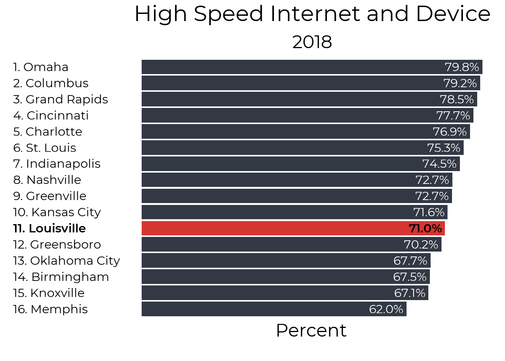

# Digital Divide 

## Overall{.tabset}

This report uses census Microdata from IPUMS to look at internet access in the Louisville MSA. Data is available from 2013 to 2018. About 1 in 10 households in Louisville have no internet access, and 3 in 10 do not have the high speed access necessary for working and learning at home. Access to high speed internet access has not improved in the past 6 years. Households also lack access to devices, with 15% of houses not having a computer or a tablet. Houses that do have computers or tablets are also unlikely to have enough devices for multiple people working from home (unfortunately the Census data only asks about having 1 or more device). 

### High Speed Internet

Our focus on internet access is a focus on high speed access. While internet access over a smartphone or other non high speed source can be useful for staying connected, in the COVID era of working and learning from home high speed internet is a necessary utility that over a quarter of our households do not have. While 91% of houses have some form of internet access, only 73% have high speed internet access. 

### Devices

A full 15% of our households do not have either a computer or tablet at home, and this understates the extent of the internet device shortage, as a single device is insufficient for a household with multiple people working and learning. 

### Internet and Devices

Finally, we can also look at the overlap of having both high speed internet and a device to work on. At 71% this is fairly similar to the numbers with high speed internet, suggesting that most people with high speed internet do have at least one device capable of accessing it. 

## The Digital Divide in Jefferson County{.tabset}

We can also take a deeper look into internet access within Louisville. We'll focus on high speed internet. While devices are also important, the data doesn't let us know how many devices are in each household, so it's guidance on the magnitude of the device shortage is quite limited. 

### Internet Speed

While our focus is on high speed access, we do show the history of both all internet access and high speed access in the graph below. Although overall internet access has increased a little since 2013, high speed internet access remains flat or possibly slightly below 2013 levels. 
In 2016, the Census Bureau began asking about smart phones for the first time. Although the internet access question was not changed, the addition of the question about smartphones may still explain the jump in consumers reporting that they had internet acess at home. There is no similar uptick in high speed access.  

### Poverty

HIgh speed internet access for households in poverty has been _decreasing_ since 2013. 

### Race

High speed internet access has either remained steady or slightly declined for Black households in Louisville. 

### Age

Households with adults age 65 and older is one of the only household groupings where high speed internet access has actually increased over time

## Child Internet Access{.tabset}

### School Age

In this section, we limit the scope of our analysis to look at children ages 5-18. Nontraditional instruction (NTI) functions much better with access to high speed internet. About 25,600 school age children in Jefferson County do not have access to high speed internet. The map below is broken into 6 areas based on public use microdata geographies. Unfortunately, this is the lowest geographic level of detail we can get with Census microdata for school-age childen.

### Metro Council Districts{.tabset}

If we expand our focus to all children ages 0-17, we can get data at finer levels of geography. The map below shows the percent of children ages 0-17 who lack either high-speed internet or a computer at home. Most of these children are school age, though the data also includes some infants and toddlers who are not in school.

#### No District labels

<table class="table table-striped table-hover table-condensed" style="margin-left: auto; margin-right: auto;">
 <thead>
  <tr>
   <th style="text-align:center;position: sticky; top:0; background-color: #FFFFFF;"> District </th>
   <th style="text-align:center;position: sticky; top:0; background-color: #FFFFFF;"> Percent without access </th>
   <th style="text-align:center;position: sticky; top:0; background-color: #FFFFFF;"> Children with access </th>
   <th style="text-align:center;position: sticky; top:0; background-color: #FFFFFF;"> Children without access </th>
  </tr>
 </thead>
<tbody>
  <tr>
   <td style="text-align:center;"> 1 </td>
   <td style="text-align:center;"> 18.2% </td>
   <td style="text-align:center;"> 5,423 </td>
   <td style="text-align:center;"> 1,205 </td>
  </tr>
  <tr>
   <td style="text-align:center;"> 2 </td>
   <td style="text-align:center;"> 11.8% </td>
   <td style="text-align:center;"> 6,438 </td>
   <td style="text-align:center;"> 865 </td>
  </tr>
  <tr>
   <td style="text-align:center;"> 3 </td>
   <td style="text-align:center;"> 22.4% </td>
   <td style="text-align:center;"> 4,669 </td>
   <td style="text-align:center;"> 1,351 </td>
  </tr>
  <tr>
   <td style="text-align:center;"> 4 </td>
   <td style="text-align:center;"> 32.5% </td>
   <td style="text-align:center;"> 3,755 </td>
   <td style="text-align:center;"> 1,805 </td>
  </tr>
  <tr>
   <td style="text-align:center;"> 5 </td>
   <td style="text-align:center;"> 33.6% </td>
   <td style="text-align:center;"> 5,036 </td>
   <td style="text-align:center;"> 2,554 </td>
  </tr>
  <tr>
   <td style="text-align:center;"> 6 </td>
   <td style="text-align:center;"> 33.2% </td>
   <td style="text-align:center;"> 4,259 </td>
   <td style="text-align:center;"> 2,111 </td>
  </tr>
  <tr>
   <td style="text-align:center;"> 7 </td>
   <td style="text-align:center;"> 3.3% </td>
   <td style="text-align:center;"> 5,608 </td>
   <td style="text-align:center;"> 187 </td>
  </tr>
  <tr>
   <td style="text-align:center;"> 8 </td>
   <td style="text-align:center;"> 1.9% </td>
   <td style="text-align:center;"> 5,067 </td>
   <td style="text-align:center;"> 100 </td>
  </tr>
  <tr>
   <td style="text-align:center;"> 9 </td>
   <td style="text-align:center;"> 4.0% </td>
   <td style="text-align:center;"> 4,867 </td>
   <td style="text-align:center;"> 205 </td>
  </tr>
  <tr>
   <td style="text-align:center;"> 10 </td>
   <td style="text-align:center;"> 7.6% </td>
   <td style="text-align:center;"> 5,114 </td>
   <td style="text-align:center;"> 421 </td>
  </tr>
  <tr>
   <td style="text-align:center;"> 11 </td>
   <td style="text-align:center;"> 5.6% </td>
   <td style="text-align:center;"> 5,819 </td>
   <td style="text-align:center;"> 342 </td>
  </tr>
  <tr>
   <td style="text-align:center;"> 12 </td>
   <td style="text-align:center;"> 7.8% </td>
   <td style="text-align:center;"> 6,200 </td>
   <td style="text-align:center;"> 523 </td>
  </tr>
  <tr>
   <td style="text-align:center;"> 13 </td>
   <td style="text-align:center;"> 12.0% </td>
   <td style="text-align:center;"> 6,399 </td>
   <td style="text-align:center;"> 874 </td>
  </tr>
  <tr>
   <td style="text-align:center;"> 14 </td>
   <td style="text-align:center;"> 9.0% </td>
   <td style="text-align:center;"> 6,229 </td>
   <td style="text-align:center;"> 618 </td>
  </tr>
  <tr>
   <td style="text-align:center;"> 15 </td>
   <td style="text-align:center;"> 27.1% </td>
   <td style="text-align:center;"> 4,620 </td>
   <td style="text-align:center;"> 1,714 </td>
  </tr>
  <tr>
   <td style="text-align:center;"> 16 </td>
   <td style="text-align:center;"> 2.3% </td>
   <td style="text-align:center;"> 7,218 </td>
   <td style="text-align:center;"> 171 </td>
  </tr>
  <tr>
   <td style="text-align:center;"> 17 </td>
   <td style="text-align:center;"> 3.2% </td>
   <td style="text-align:center;"> 7,401 </td>
   <td style="text-align:center;"> 247 </td>
  </tr>
  <tr>
   <td style="text-align:center;"> 18 </td>
   <td style="text-align:center;"> 2.7% </td>
   <td style="text-align:center;"> 5,804 </td>
   <td style="text-align:center;"> 164 </td>
  </tr>
  <tr>
   <td style="text-align:center;"> 19 </td>
   <td style="text-align:center;"> 2.5% </td>
   <td style="text-align:center;"> 7,788 </td>
   <td style="text-align:center;"> 199 </td>
  </tr>
  <tr>
   <td style="text-align:center;"> 20 </td>
   <td style="text-align:center;"> 4.2% </td>
   <td style="text-align:center;"> 8,095 </td>
   <td style="text-align:center;"> 353 </td>
  </tr>
  <tr>
   <td style="text-align:center;"> 21 </td>
   <td style="text-align:center;"> 19.9% </td>
   <td style="text-align:center;"> 4,681 </td>
   <td style="text-align:center;"> 1,161 </td>
  </tr>
  <tr>
   <td style="text-align:center;"> 22 </td>
   <td style="text-align:center;"> 4.1% </td>
   <td style="text-align:center;"> 7,379 </td>
   <td style="text-align:center;"> 315 </td>
  </tr>
  <tr>
   <td style="text-align:center;"> 23 </td>
   <td style="text-align:center;"> 9.9% </td>
   <td style="text-align:center;"> 5,911 </td>
   <td style="text-align:center;"> 650 </td>
  </tr>
  <tr>
   <td style="text-align:center;"> 24 </td>
   <td style="text-align:center;"> 8.4% </td>
   <td style="text-align:center;"> 6,850 </td>
   <td style="text-align:center;"> 632 </td>
  </tr>
  <tr>
   <td style="text-align:center;"> 25 </td>
   <td style="text-align:center;"> 3.8% </td>
   <td style="text-align:center;"> 6,040 </td>
   <td style="text-align:center;"> 241 </td>
  </tr>
  <tr>
   <td style="text-align:center;"> 26 </td>
   <td style="text-align:center;"> 10.3% </td>
   <td style="text-align:center;"> 5,291 </td>
   <td style="text-align:center;"> 590 </td>
  </tr>
</tbody>
</table>

#### District Labels

<table class="table table-striped table-hover table-condensed" style="margin-left: auto; margin-right: auto;">
 <thead>
  <tr>
   <th style="text-align:center;position: sticky; top:0; background-color: #FFFFFF;"> District </th>
   <th style="text-align:center;position: sticky; top:0; background-color: #FFFFFF;"> Percent without access </th>
   <th style="text-align:center;position: sticky; top:0; background-color: #FFFFFF;"> Children with access </th>
   <th style="text-align:center;position: sticky; top:0; background-color: #FFFFFF;"> Children without access </th>
  </tr>
 </thead>
<tbody>
  <tr>
   <td style="text-align:center;"> 1 </td>
   <td style="text-align:center;"> 18.2% </td>
   <td style="text-align:center;"> 5,423 </td>
   <td style="text-align:center;"> 1,205 </td>
  </tr>
  <tr>
   <td style="text-align:center;"> 2 </td>
   <td style="text-align:center;"> 11.8% </td>
   <td style="text-align:center;"> 6,438 </td>
   <td style="text-align:center;"> 865 </td>
  </tr>
  <tr>
   <td style="text-align:center;"> 3 </td>
   <td style="text-align:center;"> 22.4% </td>
   <td style="text-align:center;"> 4,669 </td>
   <td style="text-align:center;"> 1,351 </td>
  </tr>
  <tr>
   <td style="text-align:center;"> 4 </td>
   <td style="text-align:center;"> 32.5% </td>
   <td style="text-align:center;"> 3,755 </td>
   <td style="text-align:center;"> 1,805 </td>
  </tr>
  <tr>
   <td style="text-align:center;"> 5 </td>
   <td style="text-align:center;"> 33.6% </td>
   <td style="text-align:center;"> 5,036 </td>
   <td style="text-align:center;"> 2,554 </td>
  </tr>
  <tr>
   <td style="text-align:center;"> 6 </td>
   <td style="text-align:center;"> 33.2% </td>
   <td style="text-align:center;"> 4,259 </td>
   <td style="text-align:center;"> 2,111 </td>
  </tr>
  <tr>
   <td style="text-align:center;"> 7 </td>
   <td style="text-align:center;"> 3.3% </td>
   <td style="text-align:center;"> 5,608 </td>
   <td style="text-align:center;"> 187 </td>
  </tr>
  <tr>
   <td style="text-align:center;"> 8 </td>
   <td style="text-align:center;"> 1.9% </td>
   <td style="text-align:center;"> 5,067 </td>
   <td style="text-align:center;"> 100 </td>
  </tr>
  <tr>
   <td style="text-align:center;"> 9 </td>
   <td style="text-align:center;"> 4.0% </td>
   <td style="text-align:center;"> 4,867 </td>
   <td style="text-align:center;"> 205 </td>
  </tr>
  <tr>
   <td style="text-align:center;"> 10 </td>
   <td style="text-align:center;"> 7.6% </td>
   <td style="text-align:center;"> 5,114 </td>
   <td style="text-align:center;"> 421 </td>
  </tr>
  <tr>
   <td style="text-align:center;"> 11 </td>
   <td style="text-align:center;"> 5.6% </td>
   <td style="text-align:center;"> 5,819 </td>
   <td style="text-align:center;"> 342 </td>
  </tr>
  <tr>
   <td style="text-align:center;"> 12 </td>
   <td style="text-align:center;"> 7.8% </td>
   <td style="text-align:center;"> 6,200 </td>
   <td style="text-align:center;"> 523 </td>
  </tr>
  <tr>
   <td style="text-align:center;"> 13 </td>
   <td style="text-align:center;"> 12.0% </td>
   <td style="text-align:center;"> 6,399 </td>
   <td style="text-align:center;"> 874 </td>
  </tr>
  <tr>
   <td style="text-align:center;"> 14 </td>
   <td style="text-align:center;"> 9.0% </td>
   <td style="text-align:center;"> 6,229 </td>
   <td style="text-align:center;"> 618 </td>
  </tr>
  <tr>
   <td style="text-align:center;"> 15 </td>
   <td style="text-align:center;"> 27.1% </td>
   <td style="text-align:center;"> 4,620 </td>
   <td style="text-align:center;"> 1,714 </td>
  </tr>
  <tr>
   <td style="text-align:center;"> 16 </td>
   <td style="text-align:center;"> 2.3% </td>
   <td style="text-align:center;"> 7,218 </td>
   <td style="text-align:center;"> 171 </td>
  </tr>
  <tr>
   <td style="text-align:center;"> 17 </td>
   <td style="text-align:center;"> 3.2% </td>
   <td style="text-align:center;"> 7,401 </td>
   <td style="text-align:center;"> 247 </td>
  </tr>
  <tr>
   <td style="text-align:center;"> 18 </td>
   <td style="text-align:center;"> 2.7% </td>
   <td style="text-align:center;"> 5,804 </td>
   <td style="text-align:center;"> 164 </td>
  </tr>
  <tr>
   <td style="text-align:center;"> 19 </td>
   <td style="text-align:center;"> 2.5% </td>
   <td style="text-align:center;"> 7,788 </td>
   <td style="text-align:center;"> 199 </td>
  </tr>
  <tr>
   <td style="text-align:center;"> 20 </td>
   <td style="text-align:center;"> 4.2% </td>
   <td style="text-align:center;"> 8,095 </td>
   <td style="text-align:center;"> 353 </td>
  </tr>
  <tr>
   <td style="text-align:center;"> 21 </td>
   <td style="text-align:center;"> 19.9% </td>
   <td style="text-align:center;"> 4,681 </td>
   <td style="text-align:center;"> 1,161 </td>
  </tr>
  <tr>
   <td style="text-align:center;"> 22 </td>
   <td style="text-align:center;"> 4.1% </td>
   <td style="text-align:center;"> 7,379 </td>
   <td style="text-align:center;"> 315 </td>
  </tr>
  <tr>
   <td style="text-align:center;"> 23 </td>
   <td style="text-align:center;"> 9.9% </td>
   <td style="text-align:center;"> 5,911 </td>
   <td style="text-align:center;"> 650 </td>
  </tr>
  <tr>
   <td style="text-align:center;"> 24 </td>
   <td style="text-align:center;"> 8.4% </td>
   <td style="text-align:center;"> 6,850 </td>
   <td style="text-align:center;"> 632 </td>
  </tr>
  <tr>
   <td style="text-align:center;"> 25 </td>
   <td style="text-align:center;"> 3.8% </td>
   <td style="text-align:center;"> 6,040 </td>
   <td style="text-align:center;"> 241 </td>
  </tr>
  <tr>
   <td style="text-align:center;"> 26 </td>
   <td style="text-align:center;"> 10.3% </td>
   <td style="text-align:center;"> 5,291 </td>
   <td style="text-align:center;"> 590 </td>
  </tr>
</tbody>
</table>

## Internet as a Public Utility

The lack of high speed internet access in Louisville is part of a broader trend across the United States of continuing to treat home internet as something that is 'nice to have' instead of something that is necessary to fully take part in modern society. In general, the U.S. leaves broadband infrastructure to private companies who will not build out infrastructure to areas that aren't profitable. An exception to this trend in Chatanooga, TN, where [the electric utility is also an Internet Service Provider](https://tech.co/news/chattanooga-fastest-internet-usa-2018-08). The lack of internet acess in Louisville (and throughout the U.S) has [severe consequences](https://www.theatlantic.com/technology/archive/2020/08/virtual-learning-when-you-dont-have-internet/615322/) including exacerbating inequality (both racial and economic) and slower overall economic growth. 

### Local Efforts

- Jefferson County Public Schools have distributed hotspots and chromebooks to try to complete NTI. 
- Kentucky is investing $8 million to [subsidize internet access for low-income students](https://wfpl.org/kentucky-to-invest-in-broadband-access-for-low-income-students/)
 

For more local data and analysis please visit the [Greater Louisville Project](https://greaterlouisvilleproject.org/)
