# Black Wealth


```r
# Knitr options
knitr::opts_chunk$set(echo = TRUE, warning = FALSE, message = FALSE,
                      dev.args=list(bg="transparent"))

library(tidyverse)
library(magrittr)
library(showtext)
library(rgdal)
library(sf)
library(viridis)
library(plotly)
library(tidygeocoder)
library(leaflet)
library(rvest)
library(lubridate)

load("Black_wealth/glptools_exports.RData")
source("Black_wealth/helper_functions.R")

library(showtext)
showtext_auto()

font_add("Montserrat", "Black_wealth/Montserrat/Montserrat-Regular.ttf")
font_add("Montserrat Bold", "Black_wealth/Montserrat/Montserrat-SemiBold.ttf")

jfco_shp <- readOGR("Black_wealth/JC Tracts", layer = "JC Tracts",
                     GDAL1_integer64_policy = TRUE, verbose = FALSE)

jfco_sf <- st_as_sf(jfco_shp) %>%
  mutate(GEOID = str_sub(GEO_ID, start = -11))
```


## Introduction

There is no universally-accepted definition of wealth within the Black community. Even within the traditional definitions of monetary wealth, there is no direct data on Black Wealth in Louisville. This report looks at the available national data on monetary wealth and then looks at local data in three areas that are closely related to wealth and wealth-building: business ownership, housing finance, and income. 


## Wealth (National)

Wealth data remains scarce in general because the subject of wealth can be sensitive and is not tracked in a comprehensive way. Multiple surveys ask about income, and tax records show yearly income, but this data provides an incomplete picture, often missing key metrics such as property ownership, community investment, inherited wealth, etc. As such, our measures of wealth remain indirect. 

The national Survey of Consumer Finances (SCF), which occurs every three years, is our best source of wealth data. It measures "all assets over which a family has legal claim that can be used to finance its present and future consumption". The most recently available data is from 2019, leaving the impact of the ongoing pandemic undefined. The key findings from the [Federal Reserve report](https://www.federalreserve.gov/econres/notes/feds-notes/disparities-in-wealth-by-race-and-ethnicity-in-the-2019-survey-of-consumer-finances-20200928.htm) include:

- The median white family has \$188,200, while the median Black family has \$24,100, <i>less than 15% of what white families hold.</i> 
- After falling from 2007 to 2013, median Black wealth has increased from 2013-2019; however, the gap between White and Black families remains largely unchanged. 
- The gap in wealth starts at an early age, with white families under 35 having a median wealth of \$25,400 and Black families having \$600. 
- White families are more likely to own homes at any age, but the Black-White gap is largest in households under 35, likely reflecting parental wealth. 

The Federal Reserve Report concludes that inheritances and other sources of family support are the single largest driver of the racial wealth gap. 

## Business Ownership (Local)

Entrepreneurship is a key driver of wealth creation and generational wealth. Business owners are able to build wealth through their companies, and money spent at locally-owned businesses contribute to local wages and neighborhood development.

Data on business ownership are available for all businesses for the Louisville MSA, which includes 9 surrounding counties. At the county level, data on business ownership is only available for "employer businesses": businesses that have at least one employee.

While employer businesses only make up about 20% of local registered businesses, they comprise 98.2% of local business revenue, and so we will focus our analysis there. We do note that while Black residents only own 2.3% of employer businesses in Louisville, they own 9.8% of all businesses in the larger Louisville MSA.

Overall, the data show a large racial disparity in ownership of employer businesses in Louisville.

### Comparison to peer cities

In Jefferson County, Black residents make up 21.9% of the population, and they own 2.3% of employer businesses. The graph below compares this ratio across Louisville's cities. Cities would fall on the solid line if Black residents were represented equally among employer business owners and the population. The dotted line shows the average level of representation of Black residents among employer business owners in Louisville's peer cities. Black residents have higher-than-average representation in cities that fall above the dotted line, and they have below-average representation in cities below the line, but no cities, including Louisville, come close to equal representation. 


```r
pct_nonemp_business <- 57630 / (57630 + 14785)
pct_nonemp_revenue <- 2757359000 / (2757359000 + 152432057000)

# glpdata::population_msa_1yr %>% filter(race %in% c("black", "total"), MSA == "31140", year == 2019, sex == "total")

business_ownership_county_clean <- business_ownership_county %>%
  group_by(FIPS, year) %>%
  mutate(
    firm_percent = firms_num / firms_num[sex=="total" & race == "total"] * 100,
    revenue_percent = revenue_num / revenue_num[sex=="total" & race == "total"] * 100) %>%
  ungroup() %>%
  filter(race == "black") %>%
  pull_peers(add_info = T, FIPS_df = FIPS_df) %>%
  filter(current == 1)

business_ownership_county_summary <- business_ownership_county_clean %>%
  filter(FIPS != "21111") %>%
  summarize(avg_ratio = mean(firm_percent / pop_percent)) %>%
  pull(avg_ratio)

business_ownership_county_clean %<>%
  mutate(marker_color = if_else(city == "Louisville", '#d63631', "#000000")) 

lou <- filter(business_ownership_county_clean, city == "Louisville")

a <- list(
  x = lou$pop_percent,
  y = lou$firm_percent,
  text = lou$city,
  xref = "x",
  yref = "y",
  showarrow = F,
  arrowhead = 0,
  ax = 0,
  ay = 10,
  yanchor = "top")

b <- list(
  x = 12,
  y = 11,
  text = "Equal representation",
  xref = "x",
  yref = "y",
  showarrow = F,
  arrowhead = 0,
  ax = 0,
  ay = 30,
  xanchor = "left")

c <- list(
  x = 40,
  y = 7,
  text = "Average representation in peer cities",
  xref = "x",
  yref = "y",
  showarrow = F,
  arrowhead = 0,
  ax = 0,
  ay = -16,
  textangle = -20)

plot_ly(business_ownership_county_clean) %>%
  add_markers(x = ~`pop_percent`, y = ~`firm_percent`, 
              text = business_ownership_county_clean$city,
              color = ~I(marker_color),
              marker = list(size = 10),
              hoverinfo = 'text',
              showlegend = FALSE) %>%
  add_segments(x = 0, xend = 60, 
               y = 0, yend = 60,
               name = "Equality",
               line = list(color = '#323844', width = 1),
              showlegend = FALSE) %>%
  add_segments(x = 0, xend = 60, 
               y = 0, yend = business_ownership_county_summary * 60, 
               name = "Peer Average",
               line = list(color = '#323844', width = 1, dash = 'dash'),
              showlegend = FALSE) %>%
  layout(
    font = list(family = "Montserrat"),
    
    annotations = list(a, b, c),
    
    title = "Black Business Ownership by Peer City",
    xaxis = list(title = "Percent of Residents who are Black"),
    yaxis = list(title = "Percent of Businesses Owned by Black Residents", 
                 range = c(0, 20)))
```

```{=html}
<div id="htmlwidget-cf4a1419b184ef526d2d" style="width:672px;height:480px;" class="plotly html-widget"></div>
<script type="application/json" data-for="htmlwidget-cf4a1419b184ef526d2d">{"x":{"visdat":{"438c6851954":["function () ","plotlyVisDat"]},"cur_data":"438c6851954","attrs":{"438c6851954":{"alpha_stroke":1,"sizes":[10,100],"spans":[1,20],"x":{},"y":{},"type":"scatter","mode":"markers","text":["Birmingham","Indianapolis","Louisville","Grand Rapids","Kansas City","Omaha","Greensboro","Charlotte","Columbus","Cincinnati","Oklahoma City","Tulsa","Greenville","Nashville","Knoxville","Memphis","St. Louis"],"color":{},"marker":{"size":10},"hoverinfo":"text","showlegend":false,"inherit":true},"438c6851954.1":{"alpha_stroke":1,"sizes":[10,100],"spans":[1,20],"x":0,"y":0,"xend":60,"yend":60,"type":"scatter","mode":"lines","name":"Equality","line":{"color":"#323844","width":1},"showlegend":false,"inherit":true},"438c6851954.2":{"alpha_stroke":1,"sizes":[10,100],"spans":[1,20],"x":0,"y":0,"xend":60,"yend":9.81685242376217,"type":"scatter","mode":"lines","name":"Peer Average","line":{"color":"#323844","width":1,"dash":"dash"},"showlegend":false,"inherit":true}},"layout":{"margin":{"b":40,"l":60,"t":25,"r":10},"font":{"family":"Montserrat"},"annotations":[{"x":21.8698373096045,"y":2.43490023672641,"text":"Louisville","xref":"x","yref":"y","showarrow":false,"arrowhead":0,"ax":0,"ay":10,"yanchor":"top"},{"x":12,"y":11,"text":"Equal representation","xref":"x","yref":"y","showarrow":false,"arrowhead":0,"ax":0,"ay":30,"xanchor":"left"},{"x":40,"y":7,"text":"Average representation in peer cities","xref":"x","yref":"y","showarrow":false,"arrowhead":0,"ax":0,"ay":-16,"textangle":-20}],"title":"Black Business Ownership by Peer City","xaxis":{"domain":[0,1],"automargin":true,"title":"Percent of Residents who are Black"},"yaxis":{"domain":[0,1],"automargin":true,"title":"Percent of Businesses Owned by Black Residents","range":[0,20]},"hovermode":"closest","showlegend":false},"source":"A","config":{"showSendToCloud":false},"data":[{"x":[43.0372104241979,27.5160459833993,21.8698373096045,9.49638757065283,23.4488728635918,10.9292760229337,34.4102794746401,31.3049235863924,22.6290479503956,25.3969541251035,15.1853271367256,10.1396329065741,17.0978046196312,26.7904340441784,8.92348330662971,53.5370202174904,29.5370137709982],"y":[3.82782847452152,3.31592372160816,2.43490023672641,0.91699604743083,7.73350024341053,1.3943741436286,4.82148012703301,4.26952650748685,3.74007220216606,2.52095337873232,2.04209210252136,1.44169516529203,2.02529238375963,2.6612355736592,1.03367789263088,7.63769523951872,16.5536262066248],"type":"scatter","mode":"markers","text":["Birmingham","Indianapolis","Louisville","Grand Rapids","Kansas City","Omaha","Greensboro","Charlotte","Columbus","Cincinnati","Oklahoma City","Tulsa","Greenville","Nashville","Knoxville","Memphis","St. Louis"],"marker":{"color":["rgba(0,0,0,1)","rgba(0,0,0,1)","rgba(214,54,49,1)","rgba(0,0,0,1)","rgba(0,0,0,1)","rgba(0,0,0,1)","rgba(0,0,0,1)","rgba(0,0,0,1)","rgba(0,0,0,1)","rgba(0,0,0,1)","rgba(0,0,0,1)","rgba(0,0,0,1)","rgba(0,0,0,1)","rgba(0,0,0,1)","rgba(0,0,0,1)","rgba(0,0,0,1)","rgba(0,0,0,1)"],"size":10,"line":{"color":["rgba(0,0,0,1)","rgba(0,0,0,1)","rgba(214,54,49,1)","rgba(0,0,0,1)","rgba(0,0,0,1)","rgba(0,0,0,1)","rgba(0,0,0,1)","rgba(0,0,0,1)","rgba(0,0,0,1)","rgba(0,0,0,1)","rgba(0,0,0,1)","rgba(0,0,0,1)","rgba(0,0,0,1)","rgba(0,0,0,1)","rgba(0,0,0,1)","rgba(0,0,0,1)","rgba(0,0,0,1)"]}},"hoverinfo":["text","text","text","text","text","text","text","text","text","text","text","text","text","text","text","text","text"],"showlegend":false,"textfont":{"color":["rgba(0,0,0,1)","rgba(0,0,0,1)","rgba(214,54,49,1)","rgba(0,0,0,1)","rgba(0,0,0,1)","rgba(0,0,0,1)","rgba(0,0,0,1)","rgba(0,0,0,1)","rgba(0,0,0,1)","rgba(0,0,0,1)","rgba(0,0,0,1)","rgba(0,0,0,1)","rgba(0,0,0,1)","rgba(0,0,0,1)","rgba(0,0,0,1)","rgba(0,0,0,1)","rgba(0,0,0,1)"]},"xaxis":"x","yaxis":"y","frame":null},{"x":[0,60],"y":[0,60],"type":"scatter","mode":"lines","name":"Equality","line":{"color":"#323844","width":1},"showlegend":false,"marker":{"color":"rgba(255,127,14,1)","line":{"color":"rgba(255,127,14,1)"}},"error_y":{"color":"rgba(255,127,14,1)"},"error_x":{"color":"rgba(255,127,14,1)"},"xaxis":"x","yaxis":"y","frame":null},{"x":[0,60],"y":[0,9.81685242376217],"type":"scatter","mode":"lines","name":"Peer Average","line":{"color":"#323844","width":1,"dash":"dash"},"showlegend":false,"marker":{"color":"rgba(44,160,44,1)","line":{"color":"rgba(44,160,44,1)"}},"error_y":{"color":"rgba(44,160,44,1)"},"error_x":{"color":"rgba(44,160,44,1)"},"xaxis":"x","yaxis":"y","frame":null}],"highlight":{"on":"plotly_click","persistent":false,"dynamic":false,"selectize":false,"opacityDim":0.2,"selected":{"opacity":1},"debounce":0},"shinyEvents":["plotly_hover","plotly_click","plotly_selected","plotly_relayout","plotly_brushed","plotly_brushing","plotly_clickannotation","plotly_doubleclick","plotly_deselect","plotly_afterplot","plotly_sunburstclick"],"base_url":"https://plot.ly"},"evals":[],"jsHooks":[]}</script>
```

### Peer Ranking

This graph shows the number of employer-businesses that Black residents own for every 100 Black residents.


```r
ranking(business_ownership_county_clean,
        "firms_num_per_100",
        race = "black",
        plot_title = "Black Business Ownership",
        y_title = "Businesses per 100 residents",
        caption_text = "Source: Greater Louisville Project
                        Data from the Census Bureau Annual Business Survey",
        year = 2017,
        text_size = 2, 
        accuracy = 0.01,
        FIPS_df = FIPS_df)
```

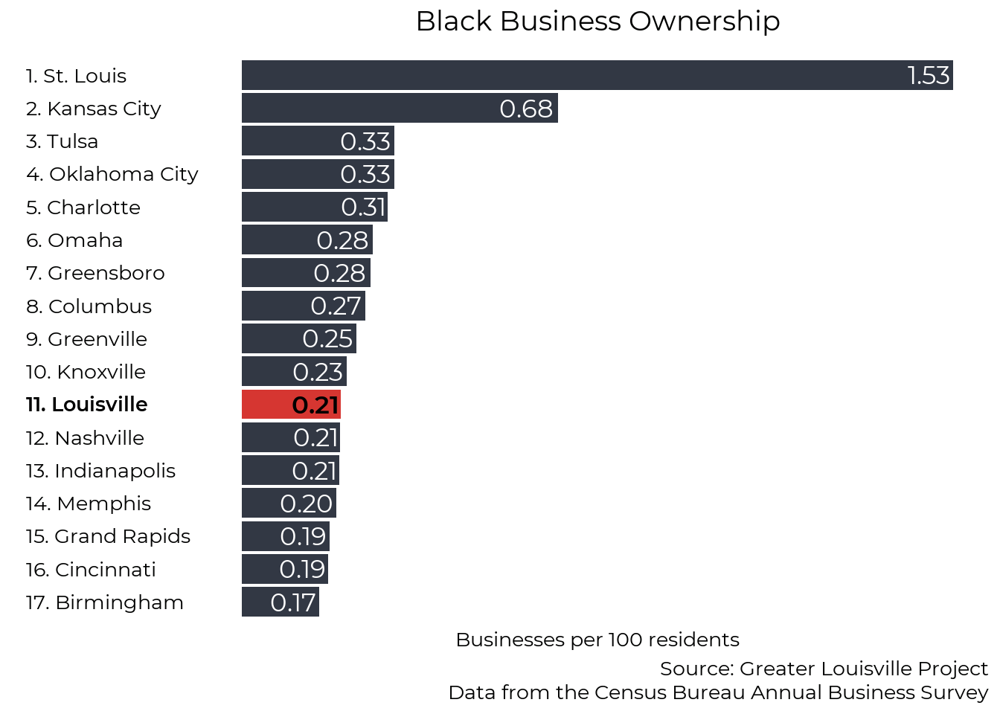

### Local business creation

The map below shows business filings throughout 2020 within Jefferson County. These businesses include any type of LLC, corporation, or nonprofit officially registered with the Commonwealth of Kentucky. Compared to the previous data that focuses on larger organizations, it shows that entrepreneurship is widespread throughout the city.


```r
cols_spec <- cols("organization_number" = col_character(),
                  "comptype" = col_number(),
                  "compseq" = col_character(),
                  "name" = col_character(),
                  "standing" = col_character(),
                  "status" = col_character(),
                  "org_country" = col_character(),
                  "org_state" = col_character(),
                  "company_type" = col_character(),
                  "registered_agent_name" = col_character(),
                  "registered_agent_address_1" = col_character(),
                  "registered_agent_address_2" = col_character(),
                  "registered_agent_address_3" = col_character(),
                  "registered_agent_address_4" = col_character(),
                  "registered_agent_city" = col_character(),
                  "registered_agent_state" = col_character(),
                  "registered_agent_zip" = col_character(),
                  "address_1" = col_character(),
                  "address_2" = col_character(),
                  "address_3" = col_character(),
                  "address_4" = col_character(),
                  "city" = col_character(),
                  "state" = col_character(),
                  "zip" = col_character(),
                  "file_date" = col_date("%m/%d/%Y"),
                  "organization_date" = col_date("%m/%d/%Y"),
                  "authorization_date" = col_date("%m/%d/%Y"),
                  "record_date" = col_date("%m/%d/%Y"),
                  "registered_agent_res_date" = col_date("%m/%d/%Y"),
                  "expiration_date" = col_date("%m/%d/%Y"),
                  "renewal_date" = col_date("%m/%d/%Y"),
                  "numofcr" = col_skip(), 
                  "numofshr" = col_skip(), 
                  "mangnum" = col_skip(),
                  "applname" = col_skip(), 
                  "appltitl" = col_skip(), 
                  "parpre" = col_skip(),
                  "parcomno" = col_skip(),
                  "parcom" = col_skip(),
                  "parpreno" = col_skip(),
                  "for_profit" = col_character(),
                  "record_num" = col_character())

#File available at https://drive.google.com/file/d/1cTCZK0A4XTru3HYPLLbDnu0DoKHlB5l1/view?usp=sharing

all_companies <- read_tsv("Black_wealth/AllCompanies20210430.txt",
                          col_names = names(cols_spec$cols),
                          col_types = cols_spec,
                          quote = "")

# Select one record per organization, excluding name reservations
all_companies %<>% 
  filter(compseq == "99999", 
         comptype %not_in% c(1, 2, 3, 4, 7, 11, 12, 13, 14),
         year(file_date) >= 2000)

lou_zips <- glptools::FIPS_zip %>% 
  filter(FIPS == "21111") %>%
  pull(zip) %>%
  as.numeric()

all_companies %<>% filter(zip %in% lou_zips)

zip_pop <- glpdata::population_zip %>%
  filter(race == "total", sex == "total", year == 2018)

t = glpdata::population_zip %>% 
  filter(FIPS == "21111", sex == "total", race == "total", year == 2019)

all_companies_zip <- all_companies %>%
  left_join(t) %>%
  filter(year(file_date) == 2020) %>%
  group_by(zip) %>%
  summarize(num_companies = n(),
            pct_here = mean(population_in_FIPS / population_total),
            pct_here = if_else(is.na(pct_here), 1, pct_here)) %>%
  summarize(sum(num_companies * pct_here))
  
all_companies_zip <- all_companies %>%
  filter(year(file_date) == 2020) %>%
  group_by(zip) %>%
  summarize(num_companies = n()) %>%
  left_join(zip_pop, by = "zip") %>%
  mutate(companies_pp = num_companies / population_total * 100,
         companies_pp = if_else(zip %in% c(40209, 40025, 40202), NA_real_, companies_pp))

ggplot(left_join(map_zip, all_companies_zip, by = "zip")) + 
  geom_sf(aes(fill = companies_pp)) +
  #scale_fill_manual(values = viridis::viridis(6, direction = -1), na.value = "grey") +
  scale_fill_viridis(name = "Filings per\n100 Residents") +
  theme_bw(base_size = 22, base_family = "Montserrat") +
  theme(panel.grid = element_blank(),
        axis.text = element_blank(),
        axis.ticks = element_blank(),
        axis.title = element_blank(),
        panel.border = element_blank(),
        legend.title = element_text(size = 18, lineheight = 0.6),
        plot.caption = element_text(lineheight = 0.6)) +
  labs(title = "Business Filings, 2020",
       caption = "Source: Greater Louisville Project
                  Data from the Kentucky Secretary of State") +
  theme(
    panel.background = element_rect(fill = "transparent", color = NA), # bg of the panel
    plot.background = element_rect(fill = "transparent", color = NA), # bg of the plot
    legend.background = element_rect(fill = "transparent", color = "transparent"), # get rid of legend bg
    legend.box.background = element_rect(fill = "transparent", color = "transparent"), # get rid of legend panel bg
    legend.key = element_rect(fill = "transparent",colour = NA))
```

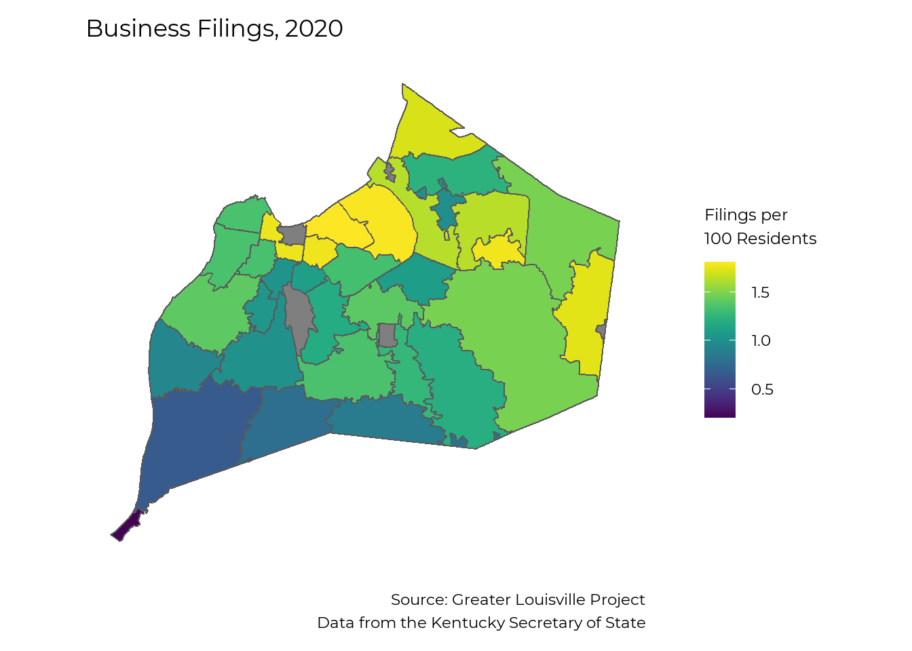

## Homeownership (Local)

Homeownership represents a significant component of wealth. Housing reflects historical wealth patterns––parental wealth makes it easier to buy a home––and is a major generator of wealth--historically, homes in most neighborhoods have risen in value, increasing the wealth of those who own them. 

The data show stark divides between Black and white families throughout the homeownership process, demonstrating one aspect of the wealth gap. 

### Home Mortgages

#### Mortgages by geography

In 2019, about 3.8 mortgages were issued per 100 residents in Jefferson County; however, the availability of mortgages varies greatly across the city. Two census tracts saw 0 mortgages issued in 2019, and most of West Louisville saw fewer than 1 mortgage issued per 100 residents. Often mortgage issuance is limited by a loan to value ratio that reflects property values in a given neighborhood relative to the replacement value of the structure Mortgage issuance is much higher in neighborhoods with higher overall value or new construction.


```r
home_loan_tract_race <- home_loan_tract %>%
  filter(year == 2019, sex == "total", race != "total") %>%
  select(tract, race, denial:rate_spread)

home_loan_tract %<>%
  filter(year == 2019, sex == "total", race == "total") %>%
  select(tract, denial:rate_spread)

jfco_sf %<>% left_join(home_loan_tract, by = c("GEOID" = "tract"))

loan_num_labs <- c("No mortgages", "Less than 1", "1 to 3", "3 to 5", "5 to 10", "More than 10")

jfco_sf %<>%
  mutate(
    loan_num_fill = 
      case_when(
        loan_number_per_100 == 0 ~ loan_num_labs[1],
        loan_number_per_100 <= 1 ~ loan_num_labs[2],
        loan_number_per_100 <= 3 ~ loan_num_labs[3],
        loan_number_per_100 <= 5 ~ loan_num_labs[4],
        loan_number_per_100 <= 10 ~ loan_num_labs[5],
        loan_number_per_100 > 10 ~ loan_num_labs[6],
        is.na(loan_number_per_100) ~ NA_character_,
        TRUE ~ "error!!") %>%
      factor(levels = loan_num_labs, ordered = TRUE))

ggplot(jfco_sf) + 
  geom_sf(aes(fill = loan_num_fill)) +
  scale_fill_manual(values = viridis::viridis(6, direction = -1), na.value = "grey") +
  theme_bw(base_size = 22, base_family = "Montserrat") +
  theme(panel.grid = element_blank(),
        axis.text = element_blank(),
        axis.ticks = element_blank(),
        axis.title = element_blank(),
        panel.border = element_blank(),
        legend.title = element_blank(),
        plot.caption = element_text(lineheight = 0.6)) +
  labs(title = "Mortgages issued per 100 residents in 2019",
       caption = "Source: Greater Louisville Project
                  GLP analysis of data from the Consumer Financial Protection Bureau") +
  theme(
    panel.background = element_rect(fill = "transparent", color = NA), # bg of the panel
    plot.background = element_rect(fill = "transparent", color = NA), # bg of the plot
    legend.background = element_rect(fill = "transparent", color = "transparent"), # get rid of legend bg
    legend.box.background = element_rect(fill = "transparent", color = "transparent"), # get rid of legend panel bg
    legend.key = element_rect(fill = "transparent",colour = NA))
```

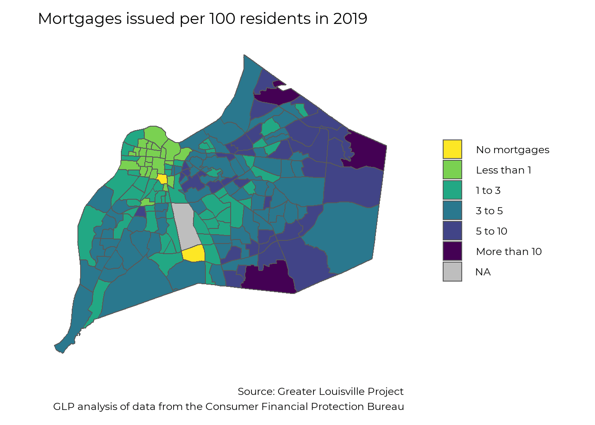

#### Mortgages by race

We can also examine mortgage data by race. Black residents in Louisville received fewer than half the number of mortgages per person that White residents did in 2019.


```r
# Interactive Mortgage map
# load("home_loans_detail.RData")
# home_loan_detail %<>%
#   select(tract, year, race, sex, loan_status, income, loan, rate) %>%
#   mutate(tract = str_extract(tract, "21111.*")) %>%
#   filter(year == 2019, loan_status == "approved")
# 
# num_points <- home_loan_detail %>%
#   group_by(tract) %>%
#   summarise(n = n(), .groups="drop") %>%
#   left_join(glptools::map_tract, by = "tract") %>%
#   group_by(tract) %>%
#   nest() %>%
#   mutate(points = map(data, function(x) st_sample(x$geometry, x$n))) %>%
#   unnest()
# 
# home_loan_detail %<>% arrange(tract)
# num_points %<>% arrange(tract)
# 
# st_geometry(home_loan_detail) <- num_points$points
# 
# library(leaflet)
# 
# 
# fillpal <- colorFactor(RColorBrewer::brewer.pal(5, "Dark2"), domain = unique(home_loan_detail$race))
# 
# leaflet(filter(home_loan_detail, is.na(race))) %>%
#   addCircleMarkers(
#     radius = ~sqrt(loan / 30000),
#     #radius = 5,
#     stroke=T,
#     fillColor = ~fillpal(race),
#     color = ~fillpal(race),
#     weight = 1,
#     fillOpacity = 0.15,
#     opacity = 0.4) %>%
#   addLegend(pal = fillpal, values = unique(home_loan_detail$race)) %>%
#   addTiles()


mortgage_county <- home_loan_county

mortgage_county %<>% filter(FIPS == "21111", sex=="total", race %in% c("black", "white")) %>%
  rename(Race = race) %>%
  mutate(Race = str_to_title(Race))

plt_by(mortgage_county, Race, loan_number_per_100, "Mortgages by race", y_axis = "Mortgages per 100 People", y_min = 0,
       caption_text = "Source: Greater Louisville Project
                  GLP analysis of data from the Consumer Financial Protection Bureau")
```

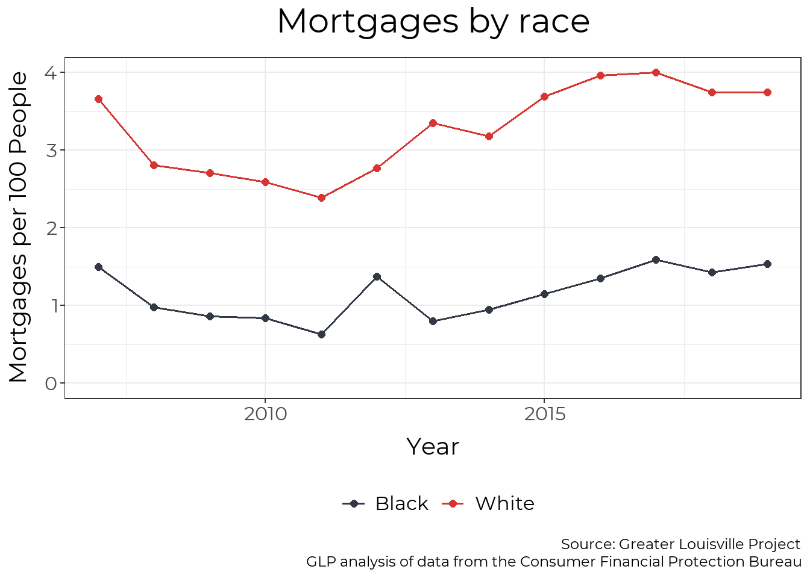

#### Mortgage Dollars by race

The racial disparity in mortgages is even larger when you incorporate the dollar amount of mortgages issued. In 2019, white residents received \$2.60 in mortgages for every \$1 that Black residents received after adjusting for population size.


```r
plt_by(mortgage_county, Race, loan_amount_pp, "Mortgage Lending by race", y_axis = "Dollars per 100 People", y_min = 0,
       units = "Dollars",
       caption_text = "Source: Greater Louisville Project
                       GLP analysis of data from the Consumer Financial Protection Bureau")
```

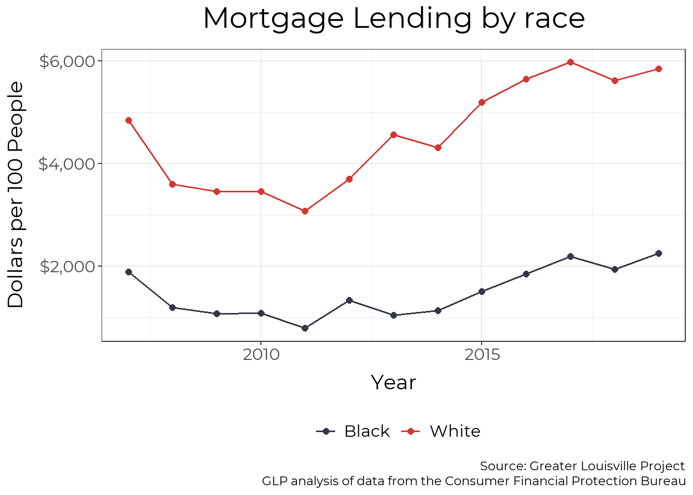


#### Denial Rates by Race

Black residents are denied mortgages at a rate roughly twice that of white residents. The mortgage denial rate for Black residents has decreased from a high of 29% in 2008 to a low of 14% in 2019. However, it has not shown signs of decreasing in recent years, and Black residents are more likely to be impacted by the economic impacts of COVID-19, worsening the disparity in 2020 and beyond.


```r
plt_by(mortgage_county, Race, denial, "Mortgage Denial by race", y_axis = "Denial Rate", y_min = 0, units= "Percent",
       caption_text = "Source: Greater Louisville Project
                       GLP analysis of data from the Consumer Financial Protection Bureau")
```

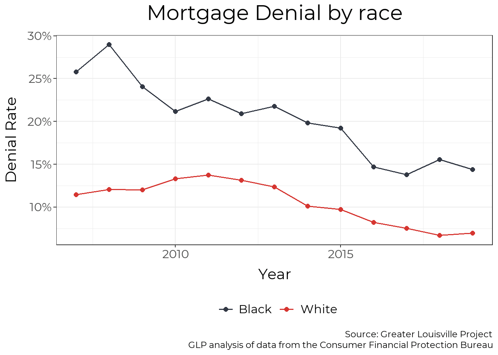

#### Denial Rates by Geography

A major factor in mortgage availability is denial rates. While some areas of town saw few to no mortgage denials, people in many parts of West Louisville experienced denial rates of 30 to 40%.


```r
make_map(denial, title = "Mortgage Denial Rate in 2019", 
         legend = "Percent", 
         caption = "Source: Greater Louisville Project
                    GLP analysis of data from the Consumer Financial Protection Bureau",
         map_obj = jfco_sf)
```

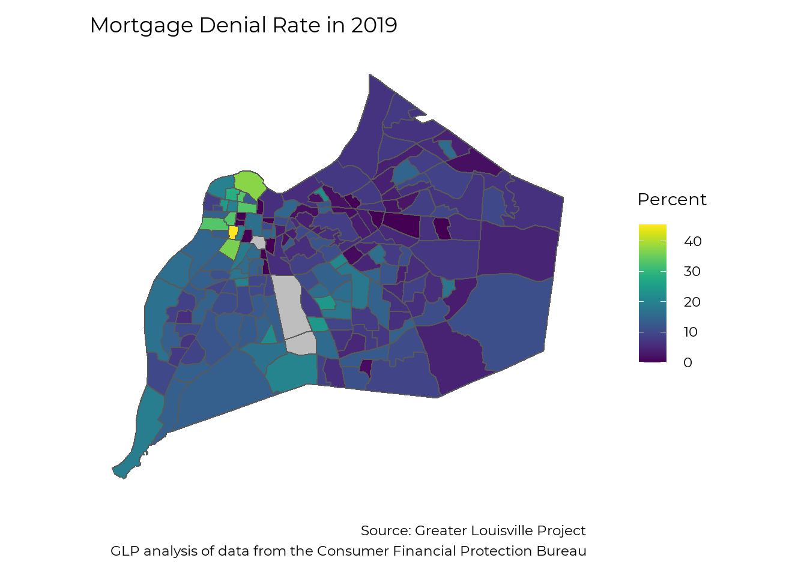

#### Interest Rates by geography

For the mortgages that were issued, interest rates varied from around 3.5% to around 5%. While the average interest rate was around 4% for the much of East Louisville, average interest rates in West Louisville were closer to 5%. A 30-year mortgage with an interest rate of 5% requires monthly payments that are 13% higher than a mortgage with an interest rate of 4%.


```r
make_map(rate, title = "Mortgage Interest Rate in 2019", 
         legend = "Percent",
         caption = "Source: Greater Louisville Project
                    GLP analysis of data from the Consumer Financial Protection Bureau",
         map_obj = jfco_sf)
```

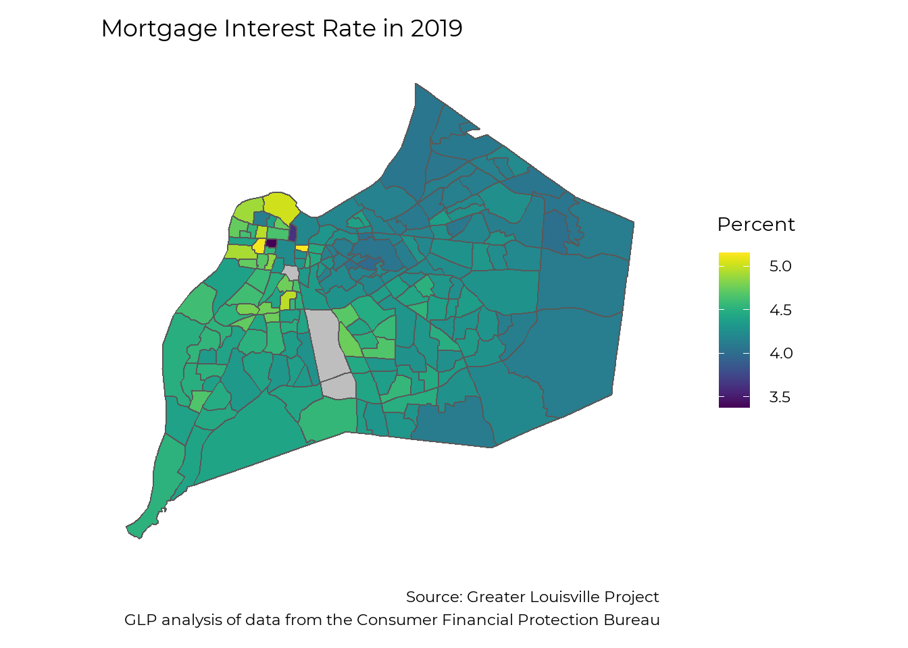

### Housing Price Changes

As Louisville grows, increasing home prices reflect changes in inflation and increasing demand for homes. Long-term growth in home prices helps homeowners build equity and wealth. Short-term appreciation can be a boon to homeowners with the finances to stay in their home, though it also causes many homeowners and renters to be dislocated from their neighborhood.

#### Long-term appreciation

This map shows the change in existing home prices across zip codes since 2000 in Jefferson County, controlling for new construction. Since 2000, existing homes in Louisville have increased in value by an average of 62% after accounting for inflation, an average of about 2.4% per year. However, not every area of the city has benefited equally from this growth. Home prices in zip code 40204, which contains the Upper Highlands and Germantown, have more than doubled since 2000. While many zip codes close to downtown also saw high growth, many parts of West Louisville saw slow growth.


```r
lou_num <- HPI_county %>% filter(FIPS == "21111")

housing_price_index <- HPI_zip

housing_price_index %<>% 
  filter(year == 2020)

map_zip %<>% left_join(housing_price_index, by = "zip")

hpi_change <- c("Lost value", "0% - 25%", "25% - 50%", "50% - 75%", "75% - 100%", "100% - 125%")

hpi_2015_change <- c("Lost value", "0% - 10%", "10% - 20%", "20% - 30%", "30% - 40%", "40% - 50%")

map_zip %<>%
  mutate(
    hpi_fill = 
      case_when(
        HPI < 100 ~ hpi_change[1],
        HPI < 125 ~ hpi_change[2],
        HPI < 150 ~ hpi_change[3],
        HPI < 175 ~ hpi_change[4],
        HPI < 200 ~ hpi_change[5],
        HPI < 225 ~ hpi_change[6],
        is.na(HPI) ~ NA_character_,
        TRUE ~ "error!!") %>%
      factor(levels = hpi_change, ordered = TRUE),
    hpi_2015_fill = 
      case_when(
        HPI5 < 0 ~ hpi_2015_change[1],
        HPI5 < 10 ~ hpi_2015_change[2],
        HPI5 < 20 ~ hpi_2015_change[3],
        HPI5 < 30 ~ hpi_2015_change[4],
        HPI5 < 40 ~ hpi_2015_change[5],
        HPI5 < 50 ~ hpi_2015_change[6],
        is.na(HPI) ~ NA_character_,
        TRUE ~ "error!!") %>%
      factor(levels = hpi_2015_change, ordered = TRUE))

ggplot(map_zip) + 
  geom_sf(aes(fill = HPI - 100)) +
  #scale_fill_manual(values = viridis::viridis(6, direction = -1), na.value = "grey") +
  scale_fill_viridis(breaks = c(25, 50, 75, 100, 125), 
                     limits = c(24, 126),
                     name = "Percent Increase") +
  theme_bw(base_size = 22, base_family = "Montserrat") +
  theme(panel.grid = element_blank(),
        axis.text = element_blank(),
        axis.ticks = element_blank(),
        axis.title = element_blank(),
        panel.border = element_blank(),
        plot.caption = element_text(lineheight = 0.6)) +
  labs(title = "Change in housing prices since 2000",
       caption = "Source: Greater Louisville Project
                  Data from Federal Housing Finance Agency HPI Tables") +
  theme(
    panel.background = element_rect(fill = "transparent", color = NA), # bg of the panel
    plot.background = element_rect(fill = "transparent", color = NA), # bg of the plot
    legend.background = element_rect(fill = "transparent", color = "transparent"), # get rid of legend bg
    legend.box.background = element_rect(fill = "transparent", color = "transparent"), # get rid of legend panel bg
    legend.key = element_rect(fill = "transparent",colour = NA))
```

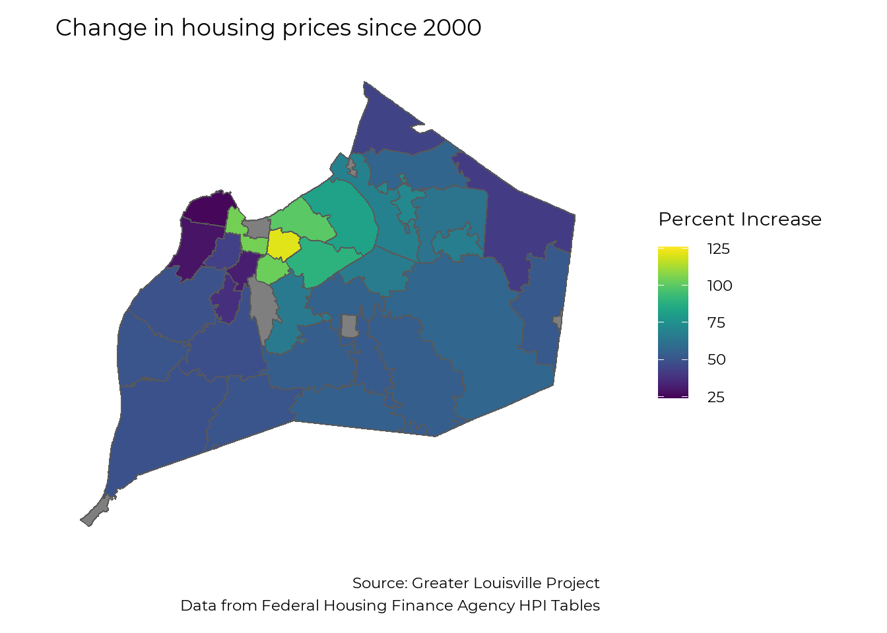

#### Short-term appreciation

Looking at the growth since 2015 highlights zip codes where changes in home prices have been very acute. The average home in Louisville increased in value by 24% between 2015 and 2020. Most zip codes saw total growth of 20% - 35%, while changes in home prices for zip codes in West Louisville range from an increase of 15% in 40212 to an increase of 46% in 40203. Home prices in 40203 have increased by an average of 7.9% per year since 2015, and they threaten to displace many residents from parts of Russell and Old Louisville. 


```r
ggplot(map_zip) + 
  geom_sf(aes(fill = HPI5)) +
  #scale_fill_manual(values = viridis::viridis(6, direction = -1), na.value = "grey") +
  scale_fill_viridis(name = "Percent Increase") +
  theme_bw(base_size = 22, base_family = "Montserrat") +
  theme(panel.grid = element_blank(),
        axis.text = element_blank(),
        axis.ticks = element_blank(),
        axis.title = element_blank(),
        panel.border = element_blank(),
        plot.caption = element_text(lineheight = 0.6)) +
  labs(title = "Change in housing prices since 2015",
       caption = "Source: Greater Louisville Project
                  Data from Federal Housing Finance Agency HPI Tables") +
  theme(
    panel.background = element_rect(fill = "transparent", color = NA), # bg of the panel
    plot.background = element_rect(fill = "transparent", color = NA), # bg of the plot
    legend.background = element_rect(fill = "transparent", color = "transparent"), # get rid of legend bg
    legend.box.background = element_rect(fill = "transparent", color = "transparent"), # get rid of legend panel bg
    legend.key = element_rect(fill = "transparent",colour = NA))
```

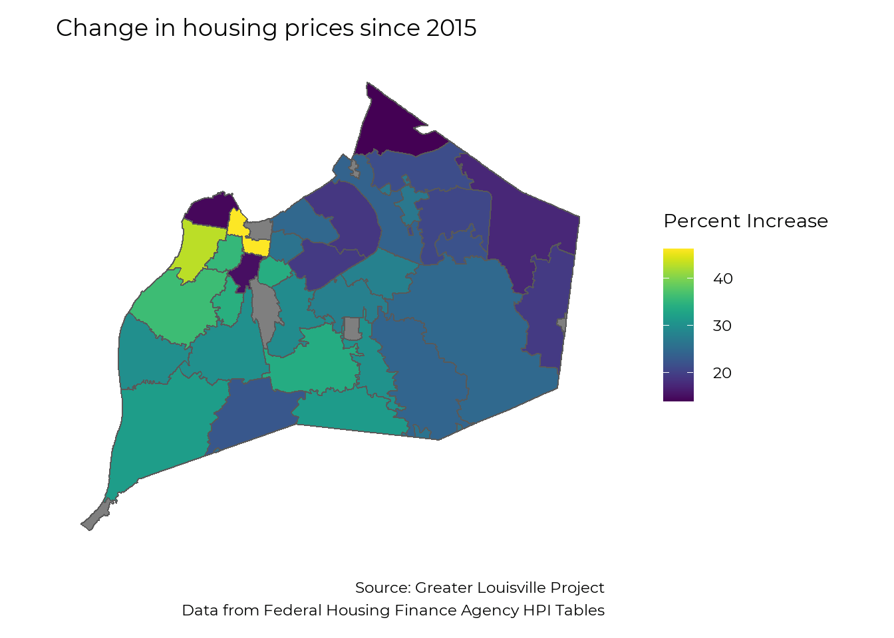

### Home Valuation by Geography


According to [research by Dr. Andre Perry at the Brookings Institute](https://www.brookings.edu/research/devaluation-of-assets-in-black-neighborhoods/), owner-occupied homes in Black neighborhoods are, on average, undervalued by $48,000 per house in the U.S. In the Louisville Metro Area, the median home value in majority Black neighborhoods is \$89,681, but would be \$117,593 if houses were not devalued, according to the same research. This difference constitutes a 27% undervaluation from what home values in Black neighborhoods would be if based on structural characteristics (e.g. sq. ft, year built) and neighborhood amenities (e.g. walkability, school districts, commute time) alone.


```r
devaluation <- read_csv("Black_wealth/devaluation.csv")

ranking_switch <- function(df, var, plot_title = "",
                    year = NULL, sex = "total", race = "total",
                    order = "Descending",
                    y_title = "Percent",
                    caption_text = "", subtitle_text = "",
                    bar_label = TRUE, sigfig = 3, accuracy = 0.1,
                    label_function, alternate_text = NULL,
                    ranking_colors = TRUE, text_size, FIPS_df){

  # Copy variable var to a new column for use with the '$' operator
  var <- dplyr:::tbl_at_vars(df, vars(!!enquo(var)))
  df$var <- df[[var]]
  # Filter to sex, race, and year
  if ("sex" %in% names(df)) df <- df[df$sex == sex,]
  if ("race" %in% names(df)) df <- df[df$race == race,]
  if("year" %in% names(df)) {
    df <- df[df$year %in% year,]
    if (length(year) > 1) {
      df %<>%
        group_by_at(df %cols_in% c("MSA", "FIPS")) %>%
        summarise(var = mean(var, na.rm = TRUE)) %>%
        ungroup()
    }
  }
  # Add peer data if not already present
   if ("city" %not_in% names(df)) {
     df %<>%
       pull_peers(add_info = T, FIPS_df = FIPS_df) %>%
       filter(current == 1)
   }

  # Sort according to order parameter
  if (order %in% c("descending", "Descending")) df %<>% arrange(desc(var))
  if (order %in% c("ascending", "Ascending"))   df %<>% arrange(var)
  df %<>% filter(!is.na(var))
  # Create numbered city labels for left side of graph
  df %<>%
    mutate(
      rank = row_number(),
      names = paste0(rank, ". ", city))
  # Set bar colors
  if (ranking_colors) {
    # color_values <- c("#96ca4f", "#ffd600", "#db2834")
    # color_names <- c("green", "yellow", "red")
    # if (order %in% c("descending", "Descending")) {color_names  = rev(color_names)}
    #
    # breaks <- classInt::classIntervals(na.omit(df$var), 3, style = "jenks")
    # df$color <- NA
    # df$color[df$var <= breaks$brks[2]] <- color_names[1]
    # df$color[df$var > breaks$brks[2] & df$var <= breaks$brks[3]] <- color_names[2]
    # df$color[df$var > breaks$brks[3]] <- color_names[3]

    color_values <- c("#323844", "#d63631")
    color_names <- c("gray", "red")

    df$color <- "red"
    df$color[df$city == "Louisville"] <- "gray"
  } else {
    df$color <- "blue"
    color_values <- "#f58021"
    color_names <- "blue"
  }
  #if (order %in% c("descending", "Descending")) color_values = rev(color_values)
  color_values = rev(color_values)
  # Create numeric labels
  # Create numeric labels
  if (!missing(label_function)) {
    label_text <- df$var %>% signif(sigfig) %>% label_function()
  } else if (y_title %in% c("Dollars", "Hourly Wage")) {
    if(mean(df$var, na.rm = TRUE) > 10000) {
      label_text <- df$var %>% signif(sigfig) %>% scales::dollar(accuracy = accuracy, scale = .001, suffix = "k")
    } else {
      label_text <- df$var %>% signif(sigfig) %>% scales::dollar(accuracy = .01)
    }
  } else if (stringr::str_detect(y_title, "Percent")) {
    label_text <- df$var %>% signif(sigfig) %>% scales::percent(accuracy = accuracy, scale = 1, suffix = "%")
  } else {
    label_text <- df$var %>% signif(sigfig) %>% scales::comma(accuracy = accuracy)
  }

  # Set text format, highlight and italicise Louisville text, highlight Louisville bar
  df$textcolor <- "#000000"
  df$textcolor[df$city %in% c("Nashville", "Greenville", "Oklahoma City", "Louisville")] <- "#000000"

  df$textfont <- "Montserrat"
  df$textfont[df$city == "Louisville"] <- "Montserrat Bold"

  label_color_names <- c("white", "black")
  label_color_values <- c("#000000", "#ffffff")

  df$label_color <- "white"
  df$label_color[df$city %in% c("Nashville", "Greenville", "Oklahoma City", "Louisville")] <- "black"
  #df$linecolor <- "#ffffff"
  #df$linecolor[df$city == "Louisville"] <- "#00a9b7"
  df$lou <- if_else(df$city == "Louisville", 1, 0)
  df$text_alignment <- 1.1
  if (!is.null(alternate_text)) df$text_alignment[df$rank %in% alternate_text] <- -0.1
  ### PLOT GRAPH

  # Initial plot
  p <- ggplot(data = df,
              aes(x = factor(names, levels = rev(names)),
                  y = var,
                  fill  = factor(color, levels = color_names, ordered = TRUE)))
  p <- p + guides(fill = FALSE, color = FALSE)
  # Add bars
  p <- p +
    geom_bar(stat = "identity",
             size = text_size) +
    coord_flip() +
    ggthemes::theme_tufte()
  p <- p + scale_fill_manual(values = color_values)
  #p <- p + scale_color_manual(values = c("#ffffff", "#00a9b7"))
  # Add features
  title_scale <- min(1, 48 / nchar(plot_title))
  p <- p + theme(text = element_text(family = "Montserrat"),
                 plot.title = element_text(size = 14 * title_scale * text_size, hjust = 0.5, margin = margin(b = 10, unit = "pt")),
                 axis.text.y = element_text(hjust = 0,
                                            size = 10 * text_size,
                                            color = rev(df$textcolor),
                                            family = rev(df$textfont)),
                 axis.title.x = element_text(size = 10 * text_size),
                 axis.ticks = element_blank(),
                 axis.text.x = element_blank(),
                 plot.caption = element_text(size = 10 * text_size, lineheight = 0.5))
  if(subtitle_text != ""){
    p <- p +
      labs(subtitle = subtitle_text) +
      theme(plot.subtitle = element_text(hjust = 0.5, size = 10 * text_size))

  }
  # Add numeric labels to bars based on bar_label parameter
  if (y_title != "" & bar_label) {
    p <- p + geom_text(aes(label = label_text,
                           hjust = text_alignment,
                           color = factor(label_color),
                           family = textfont),
                       size = 4.5 * text_size) +
      scale_colour_manual(values=c("#000000", "#ffffff"))
  }
  # Add vertical line to the left side of the bars based on the h_line parameter
  if (min(df$var, na.rm = TRUE) < 0) p <- p + geom_hline(yintercept = 0, linetype = "longdash", size = 2)
  # Add remaining text
  p <- p + labs(title = plot_title,
                y = y_title,
                x = "",
                caption = caption_text)

  p <- p +
    theme(
      panel.background = element_rect(fill = "transparent", color = NA), # bg of the panel
      plot.background = element_rect(fill = "transparent", color = NA), # bg of the plot
      legend.background = element_rect(fill = "transparent", color = "transparent"), # get rid of legend bg
      legend.box.background = element_rect(fill = "transparent", color = "transparent"), # get rid of legend panel bg
      legend.key = element_rect(fill = "transparent", colour = NA))
  
  p <- p + expand_limits(y = 15)

  p
}

ranking_switch(devaluation,
        devaluation,
        plot_title = "Devaluation of Homes in Black Neighborhoods",
        text_size = 2, 
        alternate_text=1:17,
        FIPS_df = FIPS_df,
        caption = "Source: Greater Louisville Project
                   Data from Dr. Andre Perry, Brookings Institute")
```


### Property Taxes

While facing lower home values on the market, homes in majority-Black neighborhoods are valued relatively-higher than homes in majority-white by the property tax administration, and thus face [higher taxation relative to the market value of their homes](https://www.washingtonpost.com/context/the-assessment-gap-racial-inequalities-in-property-taxation/215957a4-d5ad-47cd-821a-070cf23b6bc7/). 

The Jefferson County Property Value Administration (PVA) assesses homes every three years to determine their value, and that value is used to determine the amount of property taxes the owner owes. The PVA compares homes to similar nearby properties to determine an appropriate valuation. Based on a comparison of property tax assessments to actual sale prices, data shows that property valuations tend to overvalue homes in some neighborhoods and undervalue them in others, resulting in different property tax rates for owners. There are numerous

#### Property Assessments

The map below compares property assessments to market values. Negative values indicate that home assessments are usually lower than their market price, while postive values indicate that home assessments are, on average, higher than their market price.

Properties inside the Watterson and East of I-65 are consistently valued, and thus taxed, at a lower rate than they are worth. Most over-assessments can be found in Southwest and South Louisville.

There are numerous potential reasons for these discrepancies. One significant factor in Louisville is that homes are usually assessed every three years. In neighborhoods where home values consistently go up, market values quickly increase beyond assessment values. In neighborhoods where home values increase more slowly, market prices usually stay close to property assessments. Several other potential reasons are described in detail in the research linked above.


```r
# Load Property tax analysis webpage
page <- read_html("Black_wealth/An Evaluation of Property Tax Regressivity in Jefferson County, Kentucky.html") 

# Extract sales ratio and property tax rate data-for elements
sales_ratio_html = page %>% html_elements('script[data-for="htmlwidget-0527b478a846743b2dd4"]')
property_tax_html = page %>% html_elements('script[data-for="htmlwidget-a1602585f74d11977716"]')

sales_ratio_html %<>% html_text()
property_tax_html %<>% html_text()

# Extract relevant component and split long text strings on commas (by census tract)
sales_ratio_text <- sales_ratio_html %>%
  str_extract('<strong>Census Tract 2, .*300,200(?="])') %>%
  str_split('","')

property_tax_text <- property_tax_html %>%
  str_extract('<strong>Census Tract 2, .*300,200(?="])') %>%
  str_split('","')

# Convert to data frame and extract components using regex
tax_data <- data.frame(
  sales_ratio_raw = sales_ratio_text[[1]],
  property_tax_raw = property_tax_text[[1]])

tax_data %<>%
  mutate(
    # 'Census Tract ' followed by 1-6 characters before a comma
    sr_tract = str_extract(sales_ratio_raw, "(?<=Census Tract ).{1,6}(?=,)"),
    
    # 'Sales in Sample): ' followed by 3-5 characters before %
    sr_ratio = str_extract(sales_ratio_raw, "(?<=Sales in Sample\\)\\: ).{3,5}(?=\\%)"),
    
    # '( ' followed by any number of digits before ')'
    sr_sample = str_extract(sales_ratio_raw, "(?<=\\()\\d*(?=\\))"),
    
    # 'Median Home Value: $' followed by the rest of the string
    home_value = str_extract(sales_ratio_raw, "(?<=Median Home Value\\: \\$).*"),
    
    # 'Percent White Population: ' followed by 3-5 characters before %
    white = str_extract(sales_ratio_raw, "(?<=Percent White Population\\: ).{3,5}(?=\\%)"),
    
    # 'Census Tract ' followed by 1-6 characters before a comma
    pt_tract = str_extract(property_tax_raw, "(?<=Census Tract ).{1,6}(?=,)"),
    
    # 'Sales in Sample): ' followed by 3-5 characters before %
    pt_rate = str_extract(property_tax_raw, "(?<=Sales in Sample\\)\\: ).{3,5}(?=\\%)"),
    
    # '( ' followed by any number of digits before ')'
    pt_sample = str_extract(property_tax_raw, "(?<=\\()\\d*(?=\\))"))

# Check: tract and sample size match across all tracts. TRUE
# all(tax_data$sr_tract == tax_data$pt_tract)
# all(tax_data$sr_sample == tax_data$pt_sample)

# Create tract IDs and clean data frame
tax_data %<>%
  mutate(
    tract_start = 
      str_extract(sr_tract, "\\d{1,3}") %>% 
      str_pad(4, "left", "0"),
    tract_end = 
      str_extract(sr_tract, "(?<=\\.)\\d{1,2}") %>% 
      replace_na("00") %>%
      str_pad(2, "left", "0"),
    tract = paste0("21111", tract_start, tract_end)) %>%
  transmute(
    tract,
    sales_ratio = as.numeric(sr_ratio),
    property_tax = as.numeric(pt_rate),
    sample_size = as.numeric(sr_sample),
    pct_white = as.numeric(white),
    median_value = as.numeric(str_remove(home_value, ",")))

tax_data %<>%
  mutate(
    dif = sales_ratio - 100,
    dif_bins = 
      case_when(dif < -10 ~ "10 to 15% lower",
                dif < -5 ~ "5 to 10% lower",
                dif < 0 ~ "0 to 5% lower",
                dif < 5 ~ "0 to 5% higher",
                dif < 10 ~ "5 to 10% higher") %>%
      factor(levels = c("10 to 15% lower", "5 to 10% lower", "0 to 5% lower", "0 to 5% higher", "5 to 10% higher"), ordered = T),
    sales_ratio_bins = 
      case_when(sales_ratio < 90 ~ "85-90",
                sales_ratio < 95 ~ "90-95",
                sales_ratio < 100 ~ "95-100",
                sales_ratio < 105 ~ "100-105",
                sales_ratio < 110 ~ "105-110") %>%
      factor(levels = c("85-90", "90-95", "95-100", "100-105", "105-110"), ordered = T),
    property_tax_bins = 
      case_when(property_tax == 0.8 ~ "0.8%",
                property_tax == 0.9 ~ "0.9%",
                property_tax == 1.0 ~ "1.0%",
                property_tax == 1.1 ~ "1.1%",
                property_tax == 1.2 ~ "1.2%",
                property_tax == 1.3 ~ "1.3%",
                property_tax == 1.4 ~ "1.4%",
                property_tax == 1.5 ~ "1.5%",) %>%
      factor(levels = c("0.8%", "0.9%", "1.0%", "1.1%", "1.2%", "1.3%", "1.4%", "1.5%"), ordered = T))

pop_data <- glpdata::population_tract %>%
  filter(year ==  2016,
         race %in% c("total", "black"),
         sex == "total") %>%
  select(tract, race, population) %>%
  pivot_wider(names_from = race, values_from = population) %>%
  mutate(percent_black = black / total * 100)

tax_data %<>%
  left_join(pop_data, by = "tract")

jfco_sf %<>%
  left_join(tax_data, by = c("GEOID" = "tract"))

make_map_bins <- function(indicator, 
                     title = "", legend = "", caption = "", 
                     no_legend = FALSE, vir_dir = 1, bins, shapefile){
  plt <- ggplot(shapefile) +
    geom_sf(aes(fill={{ indicator }} )) +
    # scale_fill_gradient(low = "#323844", high = "#d63631", name = "Percent") +
    scale_fill_viridis(na.value = "grey", name = legend, direction = vir_dir,
                       discrete = T) +
    theme_bw(base_size = 22) +
    theme(plot.caption = element_text(lineheight = .5)) +
    theme(text = element_text(family = "Montserrat"),
          panel.grid = element_blank(),
          axis.text = element_blank(),
          axis.ticks = element_blank(),
          axis.title = element_blank(),
          panel.border = element_blank()) +
    labs(title = title,
         caption = caption)

  if (no_legend == TRUE){
    plt <- plt + theme(legend.position = "none")
  }

  plt <- plt +
    theme(
      panel.background = element_rect(fill = "transparent", color = NA), # bg of the panel
      plot.background = element_rect(fill = "transparent", color = NA), # bg of the plot
      legend.background = element_rect(fill = "transparent", color = "transparent"), # get rid of legend bg
      legend.box.background = element_rect(fill = "transparent", color = "transparent"), # get rid of legend panel bg
      legend.key = element_rect(fill = "transparent",colour = NA))

  return(plt)
}

make_map_bins(dif_bins, 
              title = "Assessed Value compared to Market Value",
              bins = c(-15, -10, -5, 0, 5, 10),
              caption = "Source: Greater Louisville Project
                         GLP analysis of data from University of Chicago Harris Public Policy",
              shapefile = jfco_sf)
```

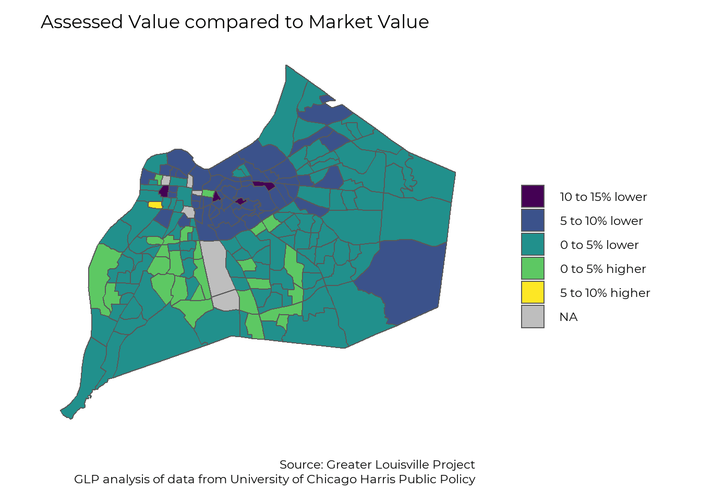

#### Property Taxes

The property tax rate for homeowners differs by location. Most homeowners across the county pay taxes toward JCPS, and most homeowners who live inside the Watterson also pay taxes to the Urban Services District. Independent cities, fire departments, and school districts charge different rates throughout the county. As a result, there is no consistent property tax rate throughout Jefferson County. Differences in property tax rates are a result of both local tax rates and property assessments.

The map below shows the effective property tax rate, or the amount of property tax homeowners paid based on the market value of their homes. The majority of homeowners pay a property tax of around 1% of their home's value. Homeowners in some neighborhoods pay slightly less, and many pay slightly more. The highest effective tax rates are found in West Louisville due to a combination of high property assessments relative to homes' values, and the property tax rate for the Urban Services District. 


```r
make_map_bins(property_tax_bins,
         title = "Effective Property Tax Rate",
         legend = "Percent of Home Value",
         caption = "Source: Greater Louisville Project
                    GLP analysis of data from University of Chicago Harris Public Policy",
         shapefile = jfco_sf)
```

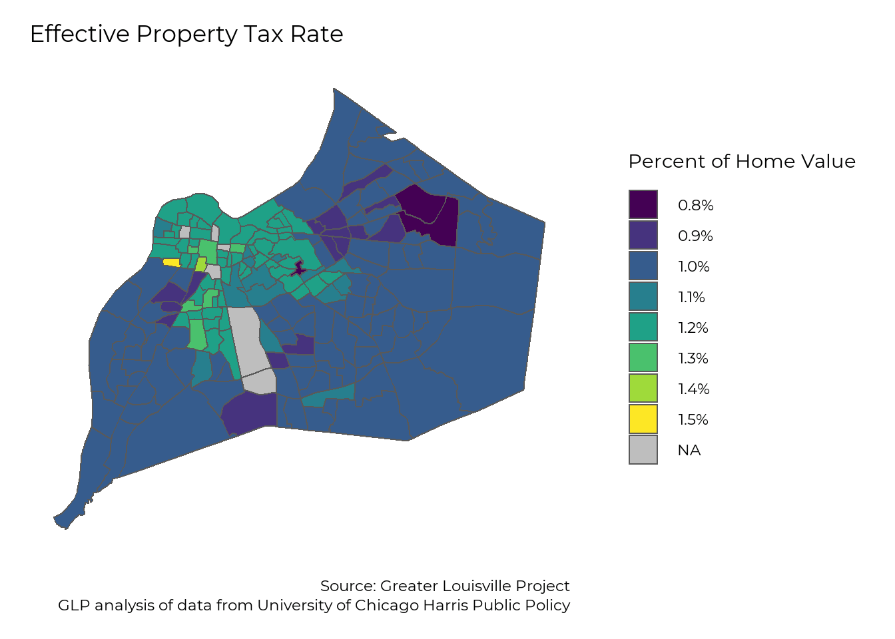

### Undervaluation and Overtaxation

This image summarizes the previous two sections (home valuation and property assessments). If homes in Black neighborhoods were valued by the market and taxed by the city like homes in other neighborhoods, homeowners in those neighborhoods would have higher-priced homes taxed at a lower rate.

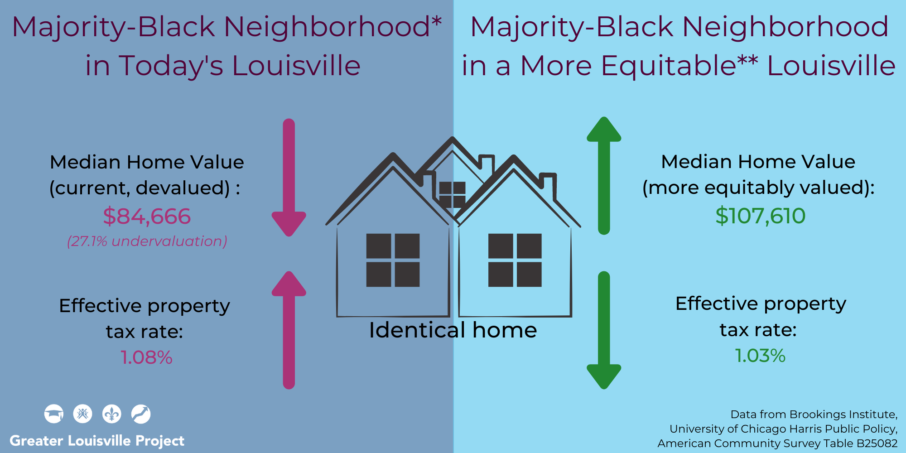
*This follows Dr. Andre Perry's (Brookings Institute) methodology in defining a majority Black neighborhood as one with ≥ 50% Black residents.

**The data on the right reflects a home price without devaluation and the average effective property tax rate of white neighborhoods in Louisville. These differences are likely not a completely just or equitable reality, but one that moves us closer to that. 


```r
# average property tax vs average property tax in a Black neighborhood
tax_data_bn <- tax_data %>%
  filter(percent_black >=50) %>%
  #summarize(prop_tax = mean(property_tax, na.rm=T))
  summarize(prop_tax = weighted.mean(property_tax, sample_size, na.rm=T)) %>% 
  pull(prop_tax)

t=tax_data %>%
  left_join(glptools::nh_tract) %>%
  group_by(pct_white<50) %>%
  summarize(
    sales_ratio = weighted.mean(sales_ratio, sample_size, na.rm=T),
    
    pct_white = mean(pct_white, na.rm=T))

ggplot(tax_data, aes(x=percent_black, y=sales_ratio)) +
  geom_point() +
  geom_smooth() +
  theme_bw(base_size = 22, base_family = "Montserrat") +
  theme(panel.grid = element_blank(),
        panel.border = element_blank(),
        legend.title = element_blank()) +
  labs(title = "Neighborhoods by Assessment Ratio and Race") +
  theme(
    panel.background = element_rect(fill = "transparent", color = NA), # bg of the panel
    plot.background = element_rect(fill = "transparent", color = NA), # bg of the plot
    legend.background = element_rect(fill = "transparent", color = "transparent"), # get rid of legend bg
    legend.box.background = element_rect(fill = "transparent", color = "transparent"), # get rid of legend panel bg
    legend.key = element_rect(fill = "transparent",colour = NA)) +
  labs(x = "Percent of Residents who are Black",
       y = "Assessment Ratio")

# Method 1: Summarize daata for each group based on Dr. Perry's definitions
nb_sales_ratio <- tax_data %>% 
  filter(percent_black <= 1) %>%
  summarize(output = weighted.mean(sales_ratio, sample_size)) %>%
  pull(output)

black_ratio <- tax_data %>% 
  filter(percent_black >= 50) %>%
  summarize(output = weighted.mean(sales_ratio, sample_size, na.rm=T)) %>%
  pull(output)

# Method 2: Summarize data for each group based on the 10% most- and 10% least-Black neighborhoods
nb_sales_ratio <- tax_data %>% 
  filter(percent_black <= quantile(percent_black, 0.1)) %>%
  summarize(output = weighted.mean(sales_ratio, sample_size)) %>%
  pull(output)

black_ratio <- tax_data %>% 
  filter(percent_black >= quantile(percent_black, 0.9)) %>%
  summarize(output = weighted.mean(sales_ratio, sample_size, na.rm=T)) %>%
  pull(output)

prop_ratio <- nb_sales_ratio / black_ratio * tax_data_bn

# Method 3: model data using splines
library(splines)

t=lm(sales_ratio~bs(percent_black, knots = quantile(tax_data$percent_black, c(0.25, 0.5, 0.75))), data=tax_data)

plot(predict(t, newdata = list(percent_black = c(0:100))),ylim=c(85, 110),type="l")
points(tax_data$percent_black, tax_data$sales_ratio)

predict(t, newdata = list(percent_black = 0))

predict(t, newdata = list(percent_black = 50:100)) %>% mean()

test <- glptools::map_muw

test_pop <- glpdata::population_muw %>%
  filter(year == 2016, sex == "total", race %in% c("black", "total")) %>%
  select(-population_change, -population_change_adj) %>%
  pivot_wider(values_from = population, names_from = race)

test %<>% 
  left_join(test_pop) %>%
  mutate(pct_black = black / total * 100)

leaflet(test) %>%
  addTiles()%>%
  addPolygons(fill = test$pct_black >= 50)
  
library(glptools)

housing_vars_05_5yr <- build_census_var_df("acs5", "B25077")
housing_map <- get_census(filter(housing_vars_05_5yr, year == 2019), "tract")

pop_map <- glpdata::population_tract %>%
  filter(year == 2016, sex == "total", race == "total") %>%
  select(tract, population)

t=housing_map %>%
  select(tract, year, var_type, value) %>%
  pivot_vartype_wider(value) %>%
  left_join(muw_tract, by = "tract") %>%
  left_join(pop_data, by = "tract") %>%
  filter(neighborhood %not_in% c("Airport", "Minor Lane Heights")) %>%
  mutate(
    estimate = if_else(estimate %in% c(9999, -666666666), NA_real_, estimate),
    MOE = if_else(MOE %in% c(-333333333, -222222222), NA_real_, MOE))

black_neighborhood_summary <- t %>%
  group_by(percent_black >= 50) %>%
  summarize(
    #estimate = weighted.mean(estimate, total, na.rm = T),
    estimate = Hmisc::wtd.quantile(estimate, total, probs = 0.5, na.rm = T),
    MOE = sqrt(sum(MOE^2)))

neighborhood_summary <- t %>%
  group_by(neighborhood) %>%
  summarize(
    estimate = weighted.mean(estimate, population),
    MOE = sqrt(sum(MOE^2)))

housing_vars_05_5yr <- build_census_var_df("acs5", "B25082")
housing_map <- get_census(housing_vars_05_5yr, "tract") %>% filter(year == 2017)

t=housing_map %>% 
  filter(label == "Estimate!!Aggregate value (dollars):",
         var_type == "estimate") %>%
  mutate(value = if_else(value == -666666666, NA_real_, value)) %>%
  left_join(pop_data, by = "tract") %>%
  group_by(percent_black >= 50) %>%
  summarize(agg_value = sum(value, na.rm = TRUE))
```

### Homeownership Rates

Black families both start with less wealth (and therefore less opportunities to build on it even in a ‘fair’ market) and this is compountded at each step of the home ownership process. 

#### Ranking

Slightly more than 1 in 3 Black Louisville residents own their own homes. While this is roughly toward the middle of our peer cities, it is roughly half the homeownership rate among white residents.


```r
housing_df <- housing_county %>%
  filter(var_type == "percent") 

housing_df_gap <- housing_df %>%
  filter(sex == "total", race %in% c("black", "white"), var_type == "percent") %>%
  select(FIPS, year, race, homeownership) %>%
  pivot_wider(values_from = homeownership, names_from = race) %>%
  mutate(gap = white - black)

ranking(housing_df, 
        homeownership, 
        race = "black",
        year = 2019,
        text_size = 2, 
        FIPS_df = FIPS_df,
        plot_title = "Black Homeownership",
        caption = "Source: Greater Louisville Project
                   GLP analysis of ACS microdata from IPUMS USA")
```

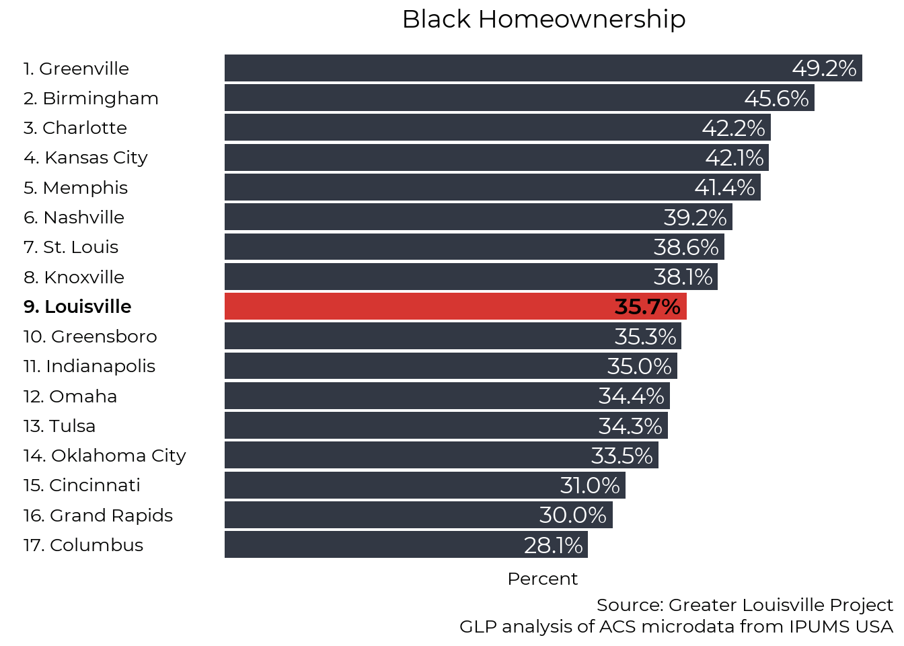

#### Trend

Homeownership among all Louisville residents, including Black residents, has declined slightly since the early 2000s. Since 2010, Louisville's racial homeownership gap has been among the largest of our peer cities.


```r
housing_df_clean <- housing_df %>%
  filter(FIPS == "21111", sex == "total", race %not_in% c("other", "hispanic")) %>%
  mutate(race = str_to_title(race))

plt_by(housing_df_clean,
       race,
       homeownership,
       title_text = "Homeownership by Race",
       caption_text = "Source: Greater Louisville Project
                       GLP analysis of ACS microdata from IPUMS USA")
```


#### Map

Across Louisville, homeownership varies from less than 10% in some areas to the high 90s in others.


```r
housing_map_clean <- housing_tract %>%
  filter(sex == "total", race == "total", year == 2017, var_type == "percent") %>%
  select(-sex, -race, -year, -var_type)

jfco_sf %<>%
  left_join(housing_map_clean, by = c("GEOID" = "tract"))

make_map(homeownership, 
         "Homeownership",
         legend = "Percent",
         caption = "Source: Greater Louisville Project
                    ACS table B25106",
         map_obj = jfco_sf)
```

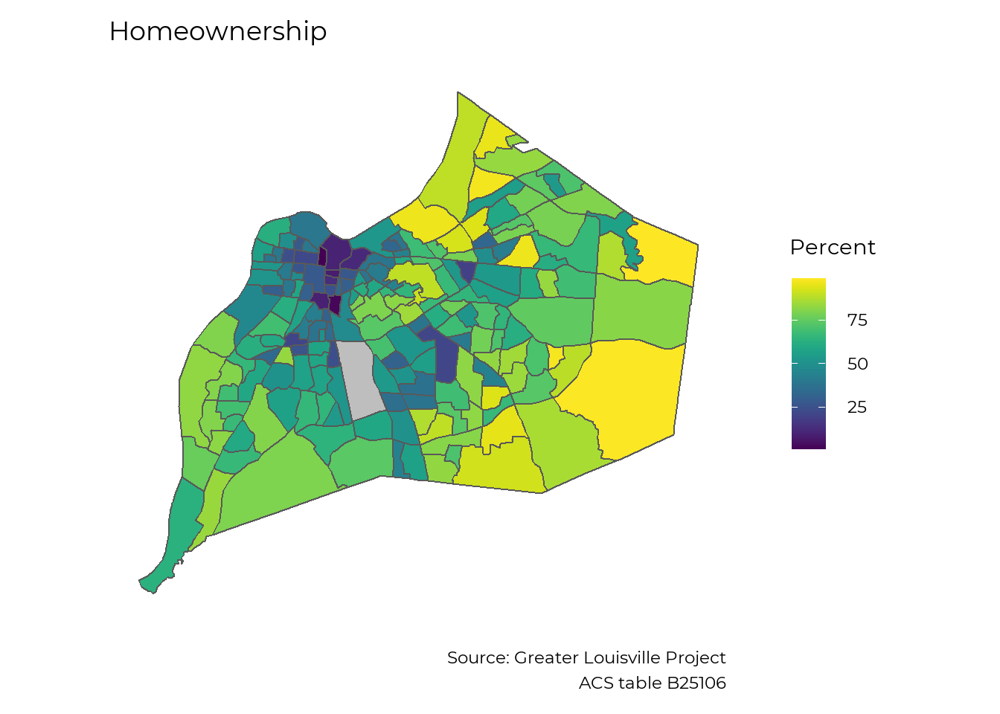

## Household Income (Local)

Many activities that lead to wealth-creation, like starting a business or getting a degree, are not directly tied to income. However, the majority of families build wealth by saving the money they earn. Disparities in income lead to larger disparities in wealth.

### Trendline

While income for Black Households in Louisville has trended up over the last few years, the median Black household only receives about two-thirds the income of the median Louisville household. After adjusting for inflation, median income declined among Black households from 2000 to 2013 and only surpassed their previous levels in 2017.


```r
hh_income_filtered <- hh_income_county %>%
  filter(var_type == "estimate", 
         race %in% c("black", "total", "white"),
         FIPS == "21111") %>%
  mutate(race = str_to_title(race))

plt_by(hh_income_filtered,
       race,
       hh_income,
       y_axis = "Dollars",
       units = "Dollars",
       title_text = "Household Income by Race",
       subtitle_text = "Adjusted for inflation to 2019 dollars",
       caption_text = "Source: Greater Louisville Project
                       ACS Tables P053, P152, B19013")
```


### Map

The median household income varies widely across Louisville, ranging from under \$20,000 in some areas to over \$150,000 in others.


```r
hh_income_tract_clean <- hh_income_tract %>%
  filter(year == 2016,
         race %in% c("total", "black")) %>%
  pivot_wider(names_from = race, values_from = hh_income, names_prefix = "hh_income_") %>%
  select(-year, -sex)

jfco_sf %<>%
  left_join(hh_income_tract_clean, by = c("GEOID" = "tract")) %>%
  mutate(hh_income_black = if_else(hh_income_black < -1000000, NA_real_, hh_income_black))

make_map(hh_income_total, 
         "Median Household income",
         legend = "Dollars",
         caption = "Source: Greater Louisville Project
                    ACS Table B19013",
         map_obj = jfco_sf)
```

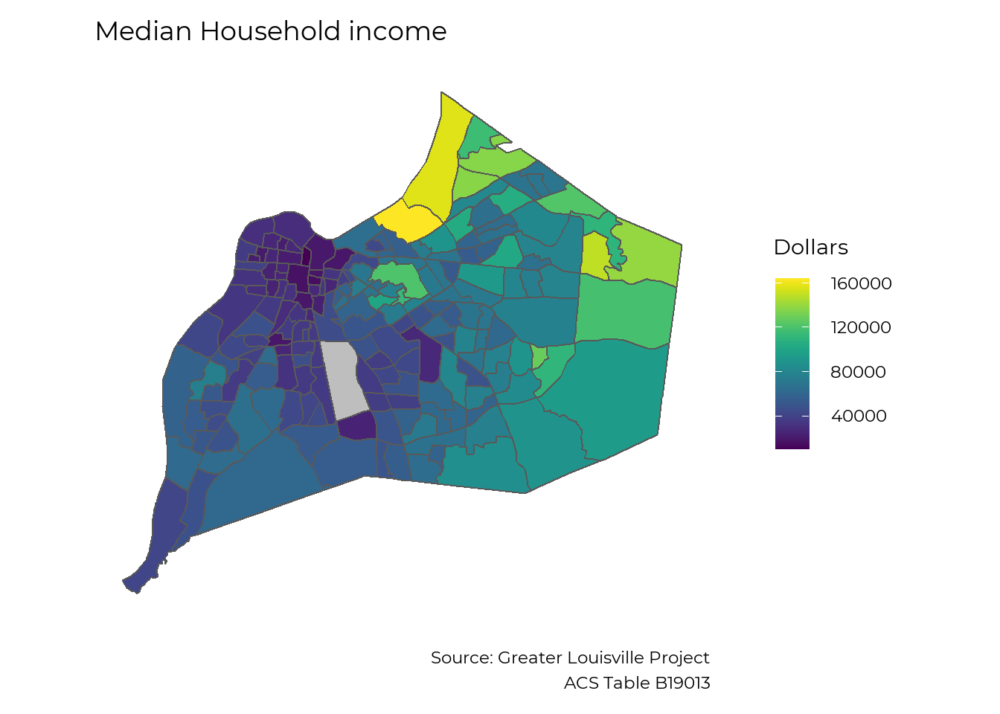

## The Tip of the Iceberg 

We have the most data on housing, income, and businesses, but these are not the only areas of wealth building where systemic inequality is pervasive. Black families start with less wealth (and therefore have less opportunities to build on it even in an 'equal’ market) and face discrimination at each step of the process. A better understanding of what metrics are important for describing Black wealth in both quantitative and qualitative terms is important to improve our work in this area, and we welcome input.

